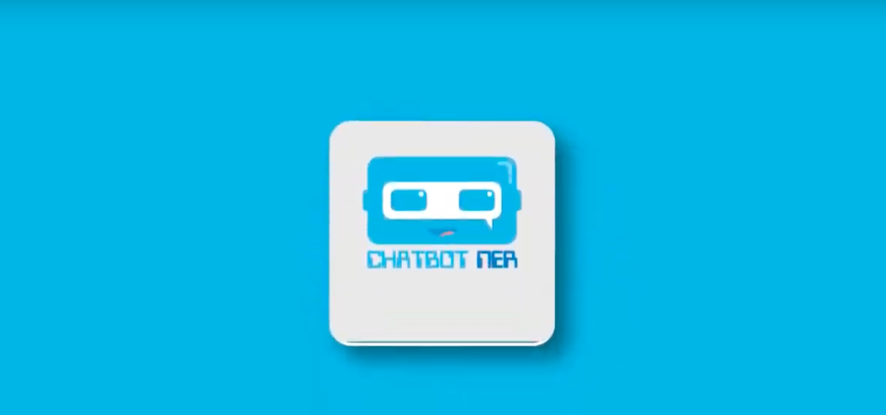

# Named Entity Recognition for chatbots

Chatbot NER is an open source framework custom built to supports entity recognition in text messages. After doing
thorough research on existing [NER](https://en.wikipedia.org/wiki/Named-entity_recognition) systems, team at Haptik felt
the strong need of building a framework which is tailored for Conversational AI and also supports Indian languages.
Currently Chatbot-ner supports **English, Hindi, Gujarati, Marathi, Bengali and Tamil** and their code mixed form.
Currently this framework uses common patterns along with few NLP techniques to extract necessary entities from languages
with sparse data. API structure of Chatbot ner is designed keeping in mind usability for Conversational AI
applications. Team at Haptik is continuously working towards porting this framework for **all Indian languages and their
respective local dialects**.

### **Installation**
Detailed documentation on how to setup Chatbot NER on your system using docker is available [here](docs/install.md).

### **Supported Entities**

| Entity type   | Code reference       | Description                              | example                           | Supported languages - **ISO 639-1** code |
| :------------ | -------------------- | :--------------------------------------- | --------------------------------- | ---------------------------------------- |
| Time          | [TimeDetector](https://github.com/hellohaptik/chatbot_ner/tree/develop/ner_v2/detectors/temporal/time) | Detect time from given text. | tomorrow morning at 5, कल सुबह ५ बजे, kal subah 5 baje | 'en', 'hi', 'gu', 'bn', 'mr', 'ta' |
| Date          | [DateAdvancedDetector](https://github.com/hellohaptik/chatbot_ner/tree/develop/ner_v2/detectors/temporal/date) | Detect date from given text | next monday, agle somvar, अगले सोमवार | 'en', 'hi', 'gu', 'bn', 'mr', 'ta' |
| Number        | [NumberDetector](https://github.com/hellohaptik/chatbot_ner/tree/develop/ner_v2/detectors/numeral/number]) | Detect number and respective units in given text | 50 rs per person, ५ किलो चावल, मुझे एक लीटर ऑइल चाहिए | 'en', 'hi', 'gu', 'bn', 'mr', 'ta' |
| Phone number  | [PhoneDetector](https://github.com/hellohaptik/chatbot_ner/tree/develop/ner_v2/detectors/pattern/phone_number) | Detect phone number in given text | 9833530536, +91 9833530536, ९८३३४३०५३५ | 'en', 'hi', 'gu', 'bn', 'mr', 'ta' |
| Email         | [EmailDetector](https://github.com/hellohaptik/chatbot_ner/tree/develop/ner_v1/detectors/pattern/email) | Detect email in text | hello@haptik.co | 'en' |
| Text          | [TextDetector](https://github.com/hellohaptik/chatbot_ner/tree/develop/ner_v1/detectors/textual/text) | Detect custom entities in text string using full text search in Datastore or based on contextual model| Order me a **pizza**, **मुंबई** में मौसम कैसा है   | Search supported for 'en', 'hi', 'gu', 'bn', 'mr', 'ta', Contextual model supported for 'en' only|
| PNR           | [PNRDetector](https://github.com/hellohaptik/chatbot_ner/tree/develop/ner_v1/detectors/pattern/pnr) | Detect PNR (serial) codes in given text. | My flight PNR is 4SGX3E | 'en' |
| regex         | [RegexDetector](https://github.com/hellohaptik/chatbot_ner/tree/develop/ner_v1/detectors/pattern/regex) | Detect entities using custom regex patterns| My flight PNR is 4SGX3E | NA |

There are other custom detectors such as [city](https://github.com/hellohaptik/chatbot_ner/tree/develop/ner_v1/detectors/textual/city),
[budget](https://github.com/hellohaptik/chatbot_ner/tree/develop/ner_v1/detectors/numeral/budget)
[shopping size](https://github.com/hellohaptik/chatbot_ner/tree/develop/ner_v1/detectors/numeral/size) which are
derived from above mentioned primary detectors but they are supported currently in English only and limited
to Indian users only. We are currently  in process of restructuring them to scale them across languages and geography
and their current versions might be deprecated in future. So **for applications already in production**, we would
recommend you to **use only primary detectors** mentioned in the table above.

### **API structure**
Detailed documentation of APIs for all entity types is available [here](docs/api_call.md). Current API structure is
built for ease of accessing it from conversational AI applications. However, it can be used for other applications also.

### **Framework Overview**

In any conversational AI application, there are several entities to be identified and logic for detection on one entity
might be different from other. We have organised this repository as shown below

We have classified entities into four main types i.e. *numeral*, *pattern*, *temporal* and *textual*.

- [numeral](https://github.com/hellohaptik/chatbot_ner/tree/develop/ner_v2/detectors/numeral): This type will contain all the entities that deal with the numeral or numbers. For example, number detection, budget detection, size detection, etc.

- [pattern](https://github.com/hellohaptik/chatbot_ner/tree/develop/ner_v2/detectors/pattern): This will contain all the detection logics where identification can be done using patterns or regular expressions. For example, email, phone_number, pnr, etc.

- [temporal](https://github.com/hellohaptik/chatbot_ner/tree/develop/ner_v2/detectors/temporal): It will contain detection logics for detecting time and date.

- [textual](https://github.com/hellohaptik/chatbot_ner/tree/develop/ner_v1/detectors/textual): It identifies entities by looking at the dictionary. This detection mainly contains detection of text (like cuisine, dish, restaurants, etc.), the name of cities, the location of a user, etc.

**Numeral, temporal and pattern** have been moved to ner_v2 for language portability with more flexible detection logic.
In ner_v1, currently only **text** entity has language support. We will be moving it to ner_v2 without any major API changes.

